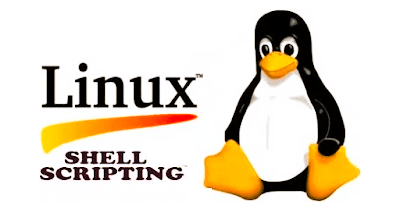

# BASH-SCRIPTING
This repository contains a collection of Bash scripts for practicing Linux and installing various DevOps tools on Ubuntu.
     
## Scripts Included
- `1update.sh`: Script to update the system.
- `2if.sh`: Script demonstrating if-else statements.
- `3loop.sh`: Script demonstrating loop constructs.
- `4loop.sh`: Another script demonstrating loop constructs.
- `Minikube.sh`: Script to install Minikube.       # It work's on t2.medium type instance or Localhost .
- `aws_cli.sh`: Script to install AWS CLI.
- `jenkins-installation.sh`: Script to install Jenkins.
- `terraform-install.sh`: Script to install Terraform.

## Usage
Clone the repository and execute the desired script with appropriate permissions:
```bash
git clone https://github.com/Bakhtawarkhan90/BASH-SCRIPTING.git
cd BASH-SCRIPTING
chmod +x script-name.sh
./script-name.sh
```
## Note : ##
 After Running the script you need to reboot your instance 
